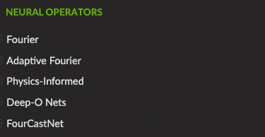

# Nvidia modulus bootcamp
  [NVIDIA Modulus](https://docs.nvidia.com/deeplearning/modulus/index.html) 将常用pde方程（包括波动方程）以及较为流行的解算子框架都进行了内置，并给出了实现1-D和2-D波动方程的例子。点击链接可以看到[Nvidia modulus bootcamp](https://b23.tv/cPBVepb)的b站视频，教如何使用modulus以及部分代码讲解。
  - [1-D波动方程](https://docs.nvidia.com/deeplearning/modulus/user_guide/foundational/1d_wave_equation.html)
  - [2-D波动方程](https://docs.nvidia.com/deeplearning/modulus/user_guide/foundational/2d_wave_equation.html)
  
  可以选择当前流行的解算子框架，将求解方程设置为波动方程进行求解，再选择流行的解算子框架中最适合求解波动方程的框架进行创新和改进以提高逼近精度。下图为当前NVIDIA Modulus中所内置的算子框架：
  